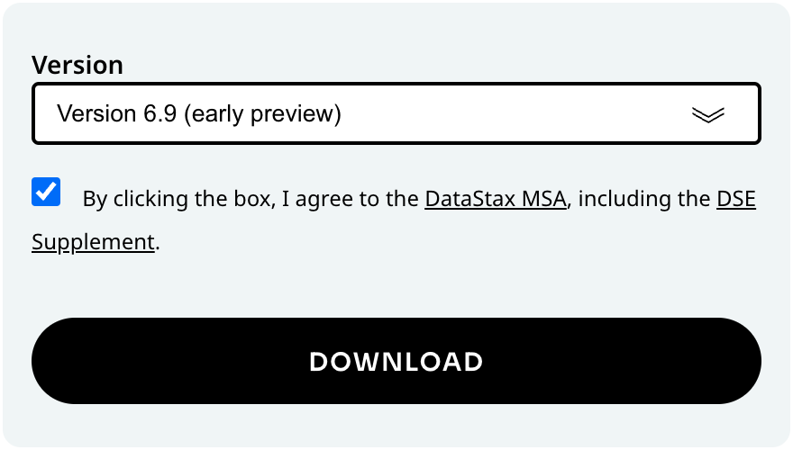

# Test drive vector search with DSE 6.9 early preview
**Build a Document Q&A chatbot in 10 lines of code!**

We [recently announced](https://www.datastax.com/blog/introducing-vector-search-for-self-managed-modern-architecture?utm_source=blog&utm_medium=website&utm_campaign=erickramirez) the upcoming release of **DataStax Enterprise 6.9** – the next iteration in the line of self-managed enterprise grade products from DataStax built on Apache Cassandra®, offering [DataStax Enterprise (DSE)](https://www.datastax.com/products/datastax-enterprise?utm_source=blog&utm_medium=blog&utm_campaign=erickramirez) customers a simple upgrade path that adds vector database capabilities for Generative AI use cases.

DataStax Enterprise continues to provide enterprises with zero-downtime 24x7 availability, global scalability, and operational simplicity as well as integrated real-time analytics with Apache Spark®, advanced search with Apache Solr™, and a distributed graph database optimized for fast data storage and traversals.

DSE 6.9 adds Java 11 support, improvements in Storage-Attached Indexes (SAI) with analyzers for enhanced search relevance plus OR operator support, and cloud-native operations and observability with [Mission Control](https://www.datastax.com/fr/blog/introduction-datastax-mission-control?utm_source=blog&utm_medium=website&utm_campaign=erickramirez).

The headline feature is the addition of vector search so developers can now integrate powerful generative AI capabilities into their workloads running on DSE! Vector search in DSE 6.9 is powered by the JVector search engine that is 10x faster than traditional Lucene-based search.

If you're new to Gen AI and not familiar with vector search, it is a method for finding related objects which have similar attributes or characteristics. Vector search uses ML model embeddings which are vectors (an array of floating point numbers) that capture the semantic essence of objects or things such as text, documents, images and videos.

Vector databases including Cassandra and DSE are a specialized type of database that stores embeddings and provides an engine that enables vector search for finding semantic similarity. Such a feature is particularly powerful when applied to RAG patterns for Gen AI. For a detailed description, see [What is Vector Search?](https://www.datastax.com/guides/what-is-vector-search?utm_source=blog&utm_medium=website&utm_campaign=erickramirez).

But talk is cheap. Take vector search for a spin with the early preview release of DSE 6.9. Let me show you how easy it is to build a classic talk-to-your-docs Q&A chatbot with a few lines of code. Let's go!

## Install DSE 6.9

### OPTION 1 - Docker installation

(for Windows, Linux & Mac users)

**STEP 1** - Create a DSE 6.9 container with the following command:

```
$ docker run \
    -e DS_LICENSE=accept \
    -p 9042:9042 \
    --name dse69preview \
    -d cr.dtsx.io/datastax/dse-server:6.9.0-early-preview
```

**STEP 2** - Monitor the startup sequence with:

```
$ docker logs -f dse69preview
```

When DSE has initialized and is ready, you should see log entries which look like:

```
INFO ... Server.java:226 - Starting listening for CQL clients on /0.0.0.0:9042 (unencrypted)...
```

```
INFO ... DseDaemon.java:818 - DSE startup complete.
```

Your DSE 6.9 cluster is now operational and ready to use. To connect to the cluster with cqlsh, run:

```
$ docker exec -it dse69preview cqlsh
```

### OPTION 2 - Binary tarball installation

(for Linux & Mac users only)

**STEP 1** - Visit [downloads.datastax.com](https://downloads.datastax.com/#enterprise?utm_source=blog&utm_medium=website&utm_campaign=erickramirez) on a browser.

**STEP 2** - Select Version 6.9 from the dropdown box and click on the checkbox to accept the terms and conditions then click the Download button:



**STEP 3** - Unpack the zipped tarball on the command line:

```
$ cd <download_location>
$ tar xzf dse-6.9.0-early-preview-bin.tar.gz
$ cd dse-6.9.0-early-preview
```

**STEP 4** - (Optional) DSE writes application logs to `/var/log/` by default. Add the following line near the top of `bin/dse-env.sh` to save the logs in `dse-6.9.0-early-preview/log/` instead:

```
export CASSANDRA_LOG_DIR="/path/to/dse-6.9.0-early-preview/log"
```

**STEP 5** - (Optional) DSE writes data files to `/var/lib/cassandra/` by default. Modify the following properties in `resources/cassandra/conf/cassandra.yaml` to save the data in `dse-6.9.0-early-preview/*` instead:

```
hints_directory: /path/to/dse-6.9.0-early-preview/hints

data_file_directories:
     - /path/to/dse-6.9.0-early-preview/data

metadata_directory: /path/to/dse-6.9.0-early-preview/metadata

commitlog_directory: /path/to/dse-6.9.0-early-preview/commitlog

cdc_raw_directory: /path/to/dse-6.9.0-early-preview/cdc_raw

saved_caches_directory: /path/to/dse-6.9.0-early-preview/saved_caches
```

**STEP 6** - Start DSE:

```
$ bin/dse cassandra
```

**STEP 7** - Monitor the startup sequence with:

```
$ tail -f log/system.log
```

When DSE has initialized and is ready, you should see log entries which look like:

```
INFO ... Server.java:226 - Starting listening for CQL clients on localhost/127.0.0.1:9042 (unencrypted)...
```

```
INFO ... DseDaemon.java:818 - DSE startup complete.
```

Your DSE 6.9 cluster is now operational and ready to use. To connect to the cluster with cqlsh, run:

```
$ bin/cqlsh
```

## App prerequisites

The app we are building will use the `demo` keyspace (similar to the concept of namespace in relational databases) by default. Connect to your cluster with `cqlsh` to create `demo`:

```
CREATE KEYSPACE demo WITH replication = {
    'class': 'SimpleStrategy',
    'replication_factor': 1
};
```

We will be using several software packages to build a RAG application with LangChain and LlamaIndex. To make it simple for developers we've put together [RAGStack](https://www.datastax.com/products/ragstack?utm_source=blog&utm_medium=website&utm_campaign=erickramirez), a curated production-ready stack of open-source software which we will install with a single command:

```
$ pip install -qU ragstack-ai
```

For this demo, download the [Vector Search whitepaper (PDF)](https://www.datastax.com/resources/whitepaper/vector-search-for-generative-ai-apps?utm_source=blog&utm_medium=website&utm_campaign=erickramirez) and place it in the `data/` directory.

```
$ mkdir data
```

Finally, we will be using OpenAI's `gpt-3.5-turbo` LLM and `text-embedding-ada-002` model so you'll need your API key from [platform.openai.com](https://platform.openai.com). If you don't already have one, simply create a new key from [the API keys section of your profile](https://platform.openai.com/settings/profile?tab=api-keys).

## Document Q&A app

Let's build the app step-by-step in Python!

First, we'll connect to the DSE cluster running locally using the [Python driver for Cassandra](https://docs.datastax.com/en/developer/python-driver/latest/index.html) and [CassIO](https://cassio.org/):

```
from cassandra.cluster import Cluster

cluster = Cluster(["127.0.0.1"])
session = cluster.connect()
```

```
import cassio

cassio.init(session=session, keyspace="demo",)
```

Supply your OpenAI API key:

```
openai.api_key = "sk-..."
```

Load the documents in the `data/` directory into memory:

```
from llama_index.core import SimpleDirectoryReader

documents = SimpleDirectoryReader('data').load_data()
```

Create and initialize the vector store instance with:

```
from llama_index.vector_stores.cassandra import CassandraVectorStore

cassandra_store = CassandraVectorStore(
    table='ragdemo', embedding_dimension=1536
)
```

Create a storage context for the vector store:

```
from llama_index.core import StorageContext

storage_context = StorageContext.from_defaults(
    vector_store=cassandra_store
)
```

With a single line of code (1) we'll split the documents into "chunks", (2) generate vector embeddings for each chunk, and (3) store both the chunk of text and corresponding embedding in the `ragdemo` table in DSE:

```
from llama_index.core import VectorStoreIndex

index = VectorStoreIndex.from_documents(
    documents, storage_context=storage_context
)
```

Now we can start asking questions about the documents. Here's a simple example question:

```
query_engine = index.as_query_engine()
response = query_engine.query("What is vector search?")
print(response)
```

And here's the response:

```
Vector search is a method used to find related objects that share similar attributes or characteristics. It involves using a specific type of machine learning model called embeddings to describe objects and their context. This approach allows vector search to locate similar data without requiring prior knowledge of the exact search query.
```

You can modify the code above to ask any question you want about the whitepaper and be amazed at the answers you get back. Take it even further and upload any document you want and ask the app all sorts of questions about the documents.

## Next steps

How about uploading your company's operating manuals? textbooks? web pages? Ask questions and get answers based on the documents you uploaded. Imagine the possibilities!

Download the complete code for [ingesting documents](demo-QA-1-ingest.py) and [querying](demo-QA-2-ask.py) here. If you have any questions or would like to learn more, [contact us today](https://www.datastax.com/lp/hyper-converged-data-platform-datastax-enterprise-6-9-contact-us?utm_source=blog&utm_medium=website&utm_campaign=erickramirez)!
